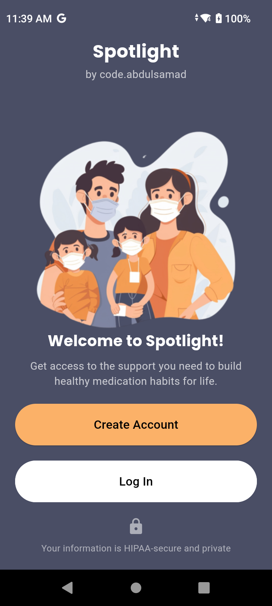
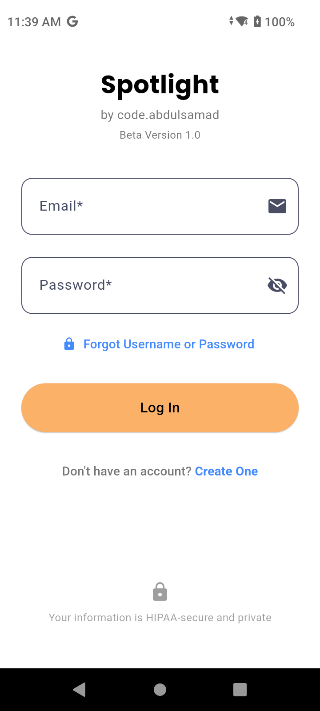
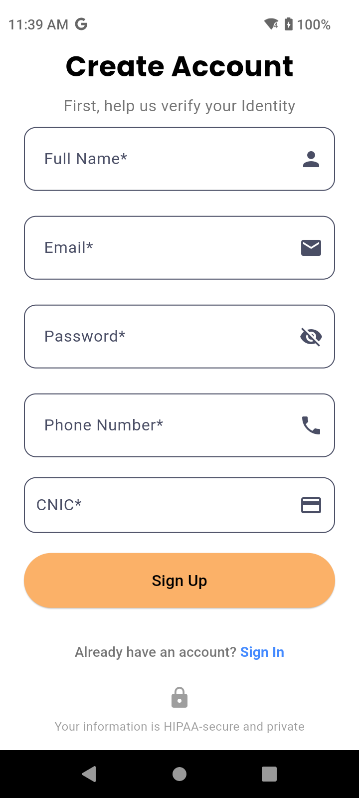
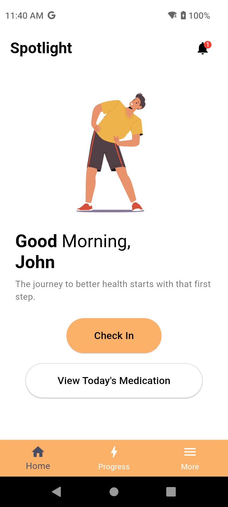
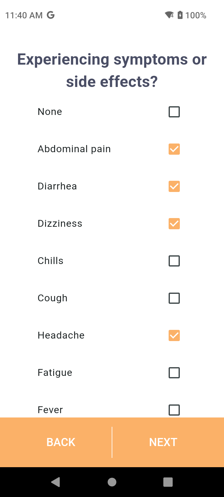
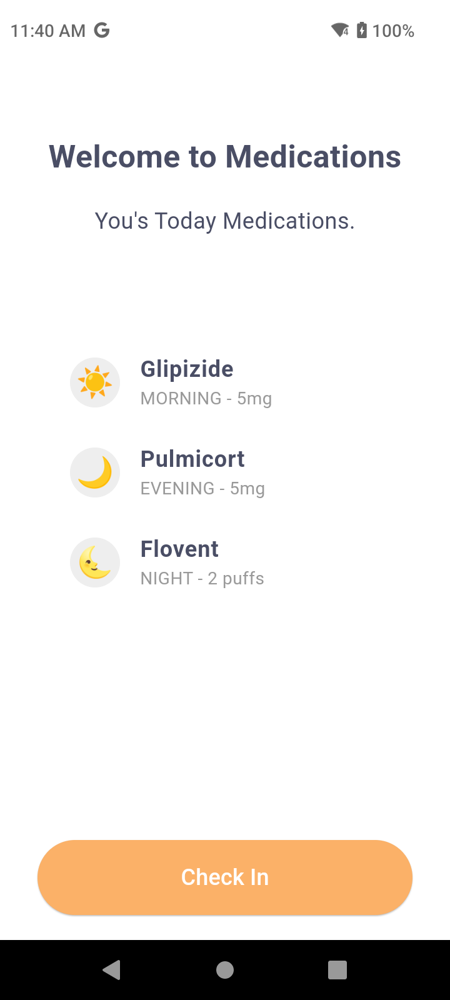
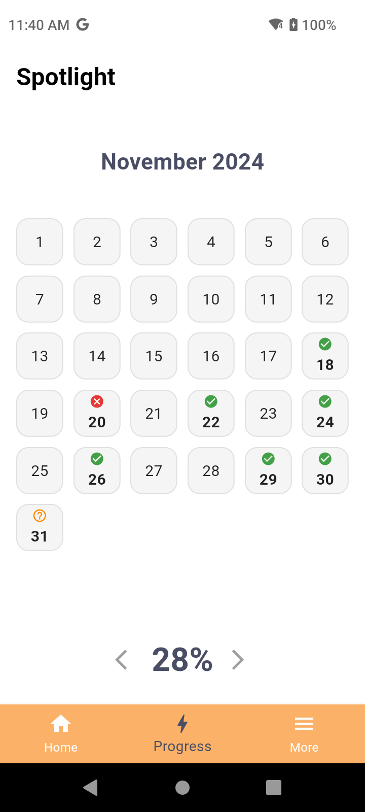
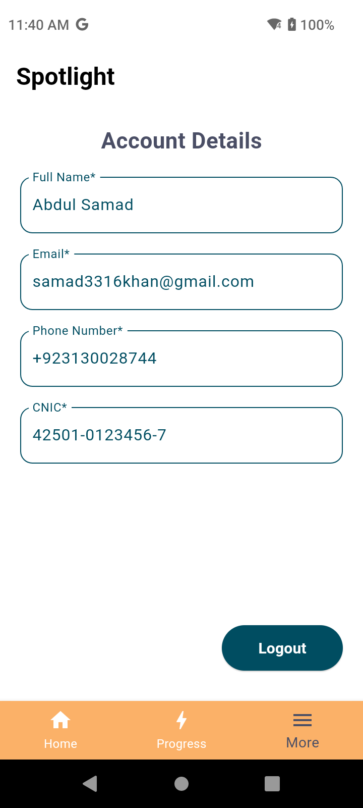
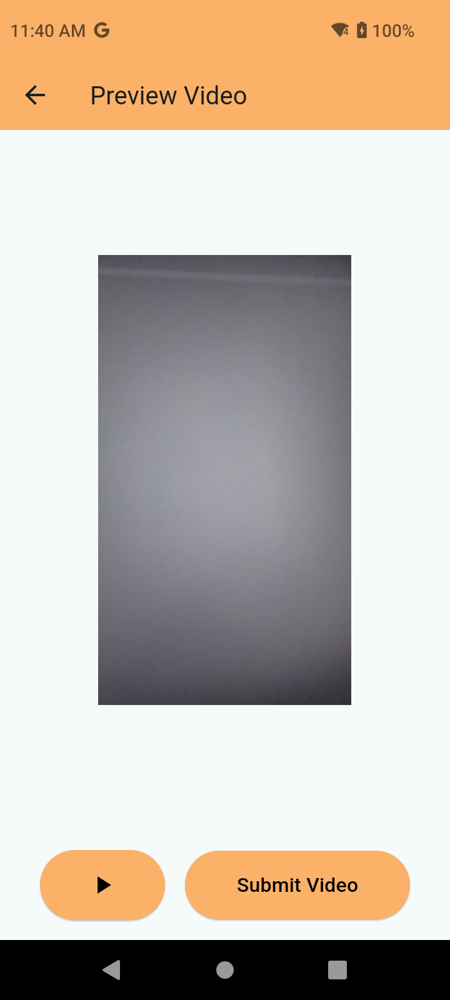
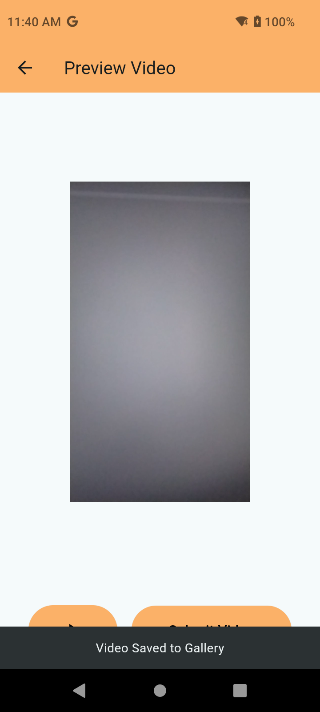

# Spotlight

Spotlight is a mobile application designed to help medical patients track their medication intake on a day-wise basis. It provides an intuitive interface for users to submit videos of their medication routine, monitor their progress, and stay consistent with their prescribed treatments.

## Features

- **Day-Wise Medication Tracking**: Log your medication intake daily with ease.
- **Video Submissions**: Upload videos of your medication routine for better accountability.
- **Progress Monitoring**: Track your progress over time with detailed insights.
- **User-Friendly UI**: Enjoy an attractive and simple interface designed for all age groups.

## App Screenshots

Below are the app screenshots showcasing various features and designs:

<table>
  <tr>
    <td></td>
<td></td>
    <td></td>
    <td></td>

  </tr>
  <tr>
    <td></td>
    <td></td>
    <td></td>
    <td></td>
  </tr>
  <tr>
    <td></td>
    <td></td>
    <td></td>
    <td></td>
  </tr>
</table>

Thank you for using Spotlight! Together, let's make medication management easier and more effective.
